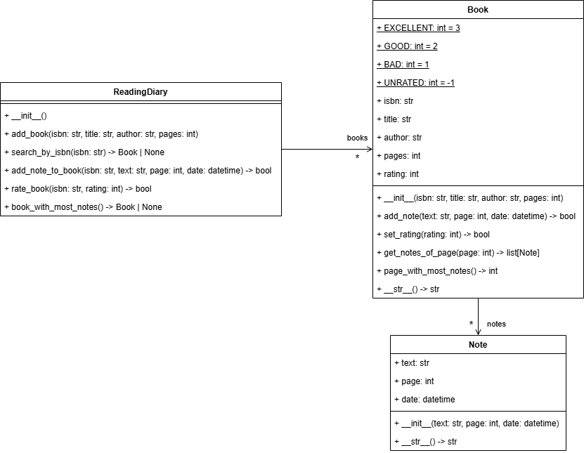

# Diario de Lectura

Reading Diary es una aplicación para evaluar el conocimiento de los conceptos de POO en Python. La aplicación es un simple diario de lectura que permite a los usuarios agregar libros y añadir notas a los libros para llevar un registro del progreso de lectura. La aplicación está implementada utilizando clases y objetos en Python.

El modelo de la aplicación es el siguiente:



El código de la aplicación está incompleto, la idea es completarlo teniendo en cuenta los siguientes pasos.

1. Completa la clase `Note` teniendo en cuenta los siguientes requisitos:
    - La clase debe tener un método `__init__` que reciba los siguientes parámetros:
        - `text` de tipo `str`.
        - `page` de tipo `int`.
        - `date` de tipo `datetime`.
        
        En el método `__init__`, la clase debe inicializar los atributos `text`, `page` y `date` con los valores recibidos como parámetros.
    - La clase debe tener un método de instancia `__str__` que devuelva una cadena de texto (`str`) con el siguiente formato:
        ```
        {date} - page {page}: {text}
        ```
        
        Donde `{date}`, `{page}` y `{text}` deben ser reemplazados con los valores de los atributos de la nota.

2. Completa la clase `Book` teniendo en cuenta los siguientes requisitos:
    - La clase debe tener una constante `EXCELLENT` de tipo `int` con valor `3`.
    - La clase debe tener una constante `GOOD` de tipo `int` con valor `2`.
    - La clase debe tener una constante `BAD` de tipo `int` con valor `1`.
    - La clase debe tener una constante `UNRATED` de tipo `int` con valor `-1`.

    - La clase debe tener un método `__init__` que reciba los siguientes parámetros:
        - `isbn` de tipo `str`.
        - `title` de tipo `str`.
        - `author` de tipo `str`.
        - `pages` de tipo `int`.
    
        En el método `__init__`, la clase debe inicializar los atributos `isbn` de tipo `str`, `title` de tipo `str`, `author` de tipo `str` y `pages` de tipo `int` con los valores recibidos como parámetros. El atributo `rating` de tipo `int` debe ser inicializado con el valor `Book.UNRATED` y el atributo `notes` de tipo `list[Note]` debe ser inicializado como una lista vacía.

    - La clase debe tener un método de instancia `add_note` que reciba los parámetros `text` de tipo `str`, `page` de tipo `int` y `date` de tipo `datetime` y devuelva un valor `bool`. El método debe hacer lo siguiente:
        - Verifica si `page` es mayor que el número total de páginas del libro. Si lo es, el método debe devolver `False`.
        - De lo contrario, el método debe crear un nuevo objeto `Note` con los parámetros recibidos y añadirlo a la lista `notes` del libro. El método debe devolver `True`.
    
    - La clase debe tener un método de instancia `set_rating` que reciba un parámetro `rating` de tipo `int` y devuelva un valor `bool`. El método debe hacer lo siguiente:
        - Verifica si el `rating` no es uno de las constantes `Book.EXCELLENT`, `Book.GOOD` o `Book.BAD`. Si no lo es, el método debe devolver `False`.
        - De lo contrario, el método debe asignarle al atributo `rating` del libro el valor del parámetro `rating` y devolver `True`.
    
    - La clase debe tener un método de instancia `get_notes_of_page` que reciba un parámetro `page` de tipo `int` y devuelva una lista `list[Note]` con las notas del libro que se encuentren en la página recibida como parámetro.

    - La clase debe tener un método de instancia `page_with_most_notes` que devuelva un `int` con la página que tiene más notas. Si no hay notas en el libro, el método debe devolver `-1`.

    - La clase debe tener un método de instancia `__str__` que devuelva una cadena de texto (`str`) con el siguiente formato:
        ```        
        ISBN: {isbn}
        Title: {title}
        Author: {author}
        Pages: {pages}
        Rating: {rating}
        ```
        
        Donde `{title}`, `{author}`, `{isbn}` y `{pages}` deben ser reemplazados con los valores de los atributos del libro. `{rating}` debe ser reemplazada con la cadena de texto `"excellent"`, `"good"`, `"bad"` o `"unrated"` dependiendo del valor del atributo `rating`.
    
3. Completa la clase `ReadingDiary` teniendo en cuenta los siguientes requisitos:

    - La clase debe tener un método `__init__` que inicialice el atributo `books` de tipo `dict[str, Book]` como un diccionario vacío.

    - La clase debe tener un método de instancia `add_book` que reciba los parámetros `isbn` de tipo `str`, `title` de tipo `str`, `author` de tipo `str` y `pages` de tipo `int` y haga lo siguiente:
        - Verifica si el `isbn` no está en el diccionario `books`. Si lo está, el método debe devolver `False`.
        - De lo contrario, el método crea un nuevo objeto `Book` con los parámetros recibidos y lo añade al diccionario `books` usando el `isbn` como clave. El método debe devolver `True`.
    
    - La clase debe tener un método de instancia `search_by_isbn` que reciba el parámetro `isbn` de tipo `str` y devuelva `Book | None`. El método debe devolver el libro con el `isbn` recibido como parámetro o `None` si el libro no se encuentra.

    - La clase debe tener un método de instancia `add_note_to_book` que reciba los parámetros `isbn` de tipo `str`, `text` de tipo `str`, `page` de tipo `int` y `date` de tipo `datetime` y devuelva un valor `bool`. El método debe hacer lo siguiente:
        - Llama al método `search_by_isbn` con el `isbn` recibido como parámetro. Si el libro no se encuentra, el método debe devolver `False`.
        - De lo contrario, llama al método `add_note` del libro con los parámetros recibidos y devuelve el valor que retorne el método `add_note`.

    - La clase debe tener un método de instancia `rate_book`. Copia el siguiente código en la clase `ReadingDiary` para completar el método:
        ```python
        def rate_book(self, isbn: str, rating: int) -> bool:
            book = self.search_by_isbn(isbn)
            if book is None:
                return False
            return book.set_rating(rating)
        ```
    
    - La clase debe tener un método de instancia `book_with_most_notes` que devuelva `Book | None`. El método debe devolver el libro con más notas o `None` si no hay libros en el diario o si todos los libros no tienen notas.
